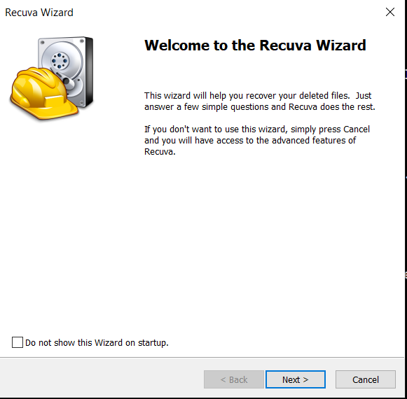

## **Procedure: Data Recovery Using Recuva**

#### **Step 1: Launch Recuva Wizard Open the Recuva application. When the Welcome Wizard appears, click Next.**

#### **Step 2: Select File Type When asked "What sort of files are you trying to recover?", select All Files to ensure the tool searches for every file type (TXT, PNG, XLSX). Click Next.**

#### **Step 3: Select Target Location Select In a specific location and browse to the USB drive (e.g., RECOVERY_LAB (E:)). This focuses the scan on the specific device where the data loss occurred. Click Next and then Start.**

#### **Step 4: Scan Results and Selection Once the scan is complete, Recuva will display a list of deleted files.**

Green Circle: Indicates the file is in excellent condition and fully recoverable.

Orange/Red Circle: Indicates the file is partially or fully overwritten. Check the boxes next to the three deleted files (Notes.txt, Budget.xlsx, Design.png).

#### **Step 5: Execute Recovery Click the Recover... button. A dialog box will appear asking for a save location. Crucial: Select a folder on your Desktop or Documents (not the USB drive) to prevent overwriting the data you are trying to save.**

#### **Step 6: Final Confirmation After the recovery is finished, Recuva will show an "Operation Completed" summary dialog indicating how many files were fully recovered.**

#### **Step 7: Verification Navigate to the recovery folder on your Desktop and open the files to verify their integrity.**

