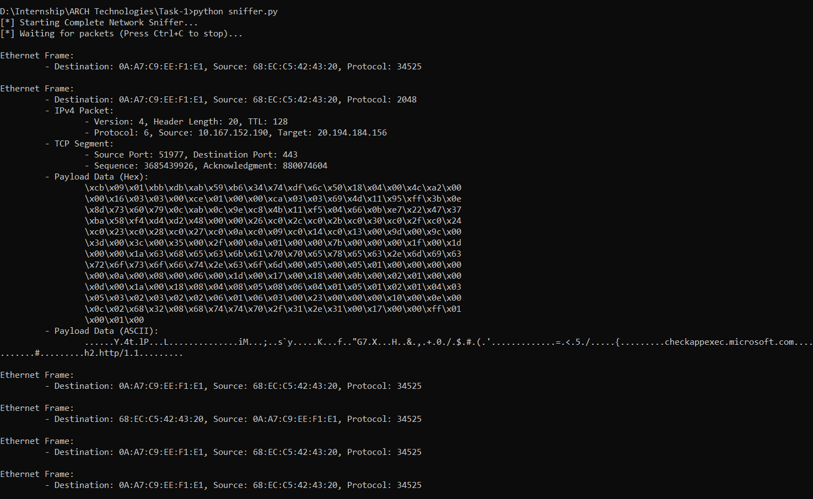

# 🦅 NetProbe: Hybrid Network Sniffer

**A professional-grade network protocol analyzer built in Python.** *Developed as part of a Cybersecurity Internship Project.*

## 📋 Overview
NetProbe is a "Hybrid" network sniffer designed to capture and analyze traffic in real-time. Unlike standard scripts that rely entirely on libraries to do the heavy lifting, **NetProbe uses a hybrid approach**:

1.  **The Capture:** Uses `Scapy` (via Npcap) to bypass Windows Raw Socket restrictions and driver issues.
2.  **The Logic:** Uses pure Python `struct` and bitwise manipulation to manually dissect packets at the binary level.

This project demonstrates a deep understanding of the **OSI Model**, **TCP/IP Stack**, **Endianness**, and **Low-Level Data Parsing**.

## ✨ Key Features
* **Real-Time Capture:** Sniffs Ethernet frames, IPv4 Packets, TCP Segments, and UDP Datagrams.
* **Deep Inspection:** Manually decodes headers (MAC addresses, IP flags, Protocol types).
* **Dual-View Output:** Displays packet payloads in both **Hexadecimal** (for analysis) and **ASCII** (for human readability).
* **Windows Compatible:** Specifically engineered to run smoothly on Windows 10/11 environments.

## 🛠️ Tech Stack
* **Language:** Python 3.x
* **Libraries:** `scapy`, `socket`, `struct`, `textwrap`
* **Concepts:** Bitwise Operations (`>>`, `&`), Endianness (`ntohs`), Struct Unpacking.

## 📸 Screenshots



## 🚀 Installation & Usage

### Prerequisites
1.  **Python 3.x** installed.
2.  **Npcap** (Required for Windows packet capture). [Download here](https://npcap.com/).
    * *Note: Ensure "Install Npcap in WinPcap API-compatible Mode" is checked.*

### Installation
```bash
# Clone the repository
git clone [https://github.com/your-username/NetProbe.git](https://github.com/your-username/NetProbe.git)

# Install dependencies
pip install scapy